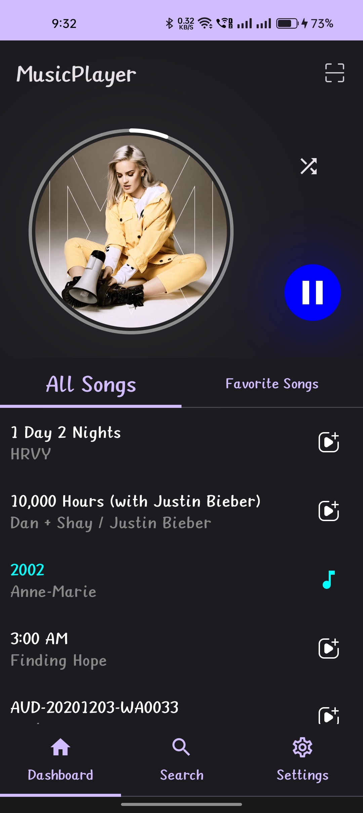

# Rhythm - MusicPlayer Compose App

## Table of Contents

- [Introduction](#introduction)
- [Features](#features)
- [Installation](#installation)
- [Usage](#usage)
- [Screenshots](#screenshots)
- [Contributing](#contributing)
- [License](#license)

## Introduction

Rhythm is a music player app built using Jetpack Compose for a modern, intuitive, and smooth user experience. This project aims to showcase the capabilities of Compose in building complex UIs with ease.

## Features

- Play and manage your music library
- Customizable playback controls
- Seamless navigation and transitions
- Beautiful and responsive UI

## Installation

To run this project locally, follow these steps:

1. Clone the repository:
   ```bash
   git clone https://github.com/anupamdas-das/MusicPlayer-Compose.git
   ```
2. Open the project in Android Studio.
3. Build and run the project on your Android device or emulator.

## Usage

- Browse your music library
- Use playback controls to play, pause, skip, and seek tracks
- Enjoy a visually appealing music player interface

## Screenshots
<p align="center">
  
  
</p>

## Contributing

Contributions are welcome! If you'd like to contribute, please fork the repository and use a feature branch. Pull requests are warmly welcome.

1. Fork the repository
2. Create your feature branch (git checkout -b feature/your-feature)
3. Commit your changes (git commit -am 'Add some feature')
4. Push to the branch (git push origin feature/your-feature)
5. Create a new Pull Request

## License

This project is licensed under the MIT License - see the LICENSE file for details.